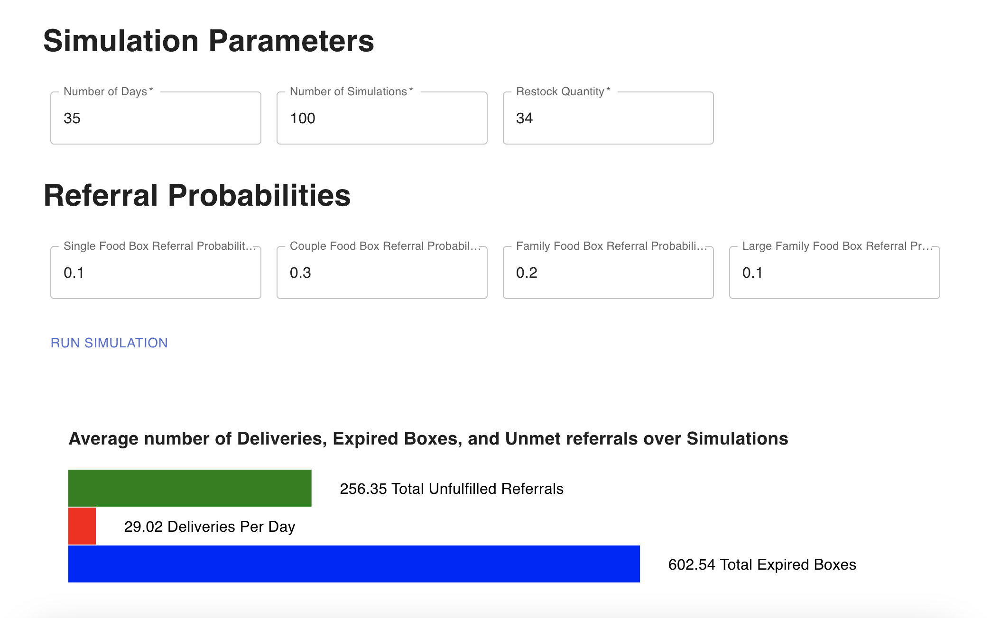

# Food Bank Simulation

This is a simulation of a food bank that is designed to simulate the number of boxes of food that are referred to households, delivered to the food bank, and the number of expired boxes of food that are in the food bank's inventory over a given period of time.

The app is divided into two directories and components:

- backend (Express based API that exposes a single route to run the MC simulation based on request parameters contained in the body)
- frontend (Next.js SPA which uses material ui and d3 to render a simple interface to input parameters and return a visualisation of the result)

## Backend

### Setup
To run the simulation, you will need to install the following dependencies:

- Node.js (v18) & Npm
- Typescript
- Express
- Body-parser
- Helmet
- Cors

Run: `npm i` to install deps
Run: `npm run serve` to run the app locally w/ hot reload

### Usage
To use the simulation, you will need to make a `POST` request to `/api/simulation` with a request body that contains the following parameters:
- `numberOfDays`: The number of days to run the simulation for
- `numberOfSimulations`: The number of simulations to run
- `restockQuantity`: The number of boxes of food to restock when the inventory is low
- `referralProbabilities`: The probabilities of each type of household receiving a referral (0 - 1)

The response will contain the following parameters:
- `avgNumberOfUnfulfilledReferrals`: The average number of unfulfilled referrals over the course of the simulations
- `avgNumberOfDeliveriesPerDay`: The average number of deliveries per day
- `avgNumberOfExpiredBoxesOfFood`: The average number of expired boxes of food over the course of the simulations

### Constants
The following constants are used in the simulation:
- `FOOD_REFILL_THRESHOLD`: The number of boxes of food below which the food bank will restock
- `LOGGING`: A flag to enable logging of the current state of the food bank

### Classes
The following classes are used in the simulation:
- `FoodBox`: Represents a box of food
- `FoodBank`: Represents a food bank, and contains all the logic for simulating the food bank's state over a period of time

### Functions
The following functions are used in the simulation:
- `generateRandom`: Generates a random number between two given numbers, with a given mean
- `simulateNumberOfBoxReferrals`: Simulates the number of referrals for a single box, based on the given probabilities

## Frontend

This project is a front-end implementation of the Monte Carlo food bank simulation. It allows you to simulate different scenarios and visualize the results.

### Prerequisites

This project requires Node.js and the following packages:

* react (v18)
* next
* d3
* typescript
* mui

### Installation

1. Clone the repository
2. Run `npm install`
3. Run `npm start` to start the development server

### Usage

The project can be used to simulate different food bank scenarios. You can adjust the parameters such as number of days, number of simulations, restock quantity, and referral probabilities. Once you run the simulation, the results will be visualized in a graph. 

### Architechture

The project consists of a `index.tsx` file which serves as the entry point for the application. It imports the necessary components and sets the default state for the chart data. 

The `InputFields.tsx` component is responsible for rendering the input fields. It also has a function for handling the simulation click event which sends a POST request to the backend API with the simulation parameters.

The `Chart.tsx` component is responsible for visualizing the results. It uses D3.js to render the chart.

### API requests

The API requests are handled by the `InputFields.tsx` component. It sends a POST request with the simulation parameters to the backend API and handles the response. The response is then passed to the parent component using a callback function. 

### State management

  State management is done using React's useState hook. The state is set and updated in the `index.tsx` component. The `InputFields.tsx` component also sets the simulation parameters in its local state. 

# Flaws and Known issues

- The current implementation is not the most efficient way to pass data from the child to the parent component. A better solution would be to use a context or Redux. 
- Testing is not implemented yet. (Likely a fair amount of bugs)
- The code could be refactored to be more organized and easier to read. 
- Performance of running multiple simulations can be improved.
- Assumes user input is always valid
- No linting/formatting in backend
- Input.tsx component could be refactored to include less repeated code
- API validation and UI user input validation is missing
- Function readbility for some of the food bank simulation methods isn't amazing, could refactor some of the loops to be more clean and maybe more functional
- Assumptions made about the Monte Carlo model:
    - Days open and not open do not change
    - The user can set the restock level (and this is constant per box type)
- Backend code could be modularised/split into separate files
- Nothing done around deployment or CI
- No accessibility or test automation sensibilites made for UI.

